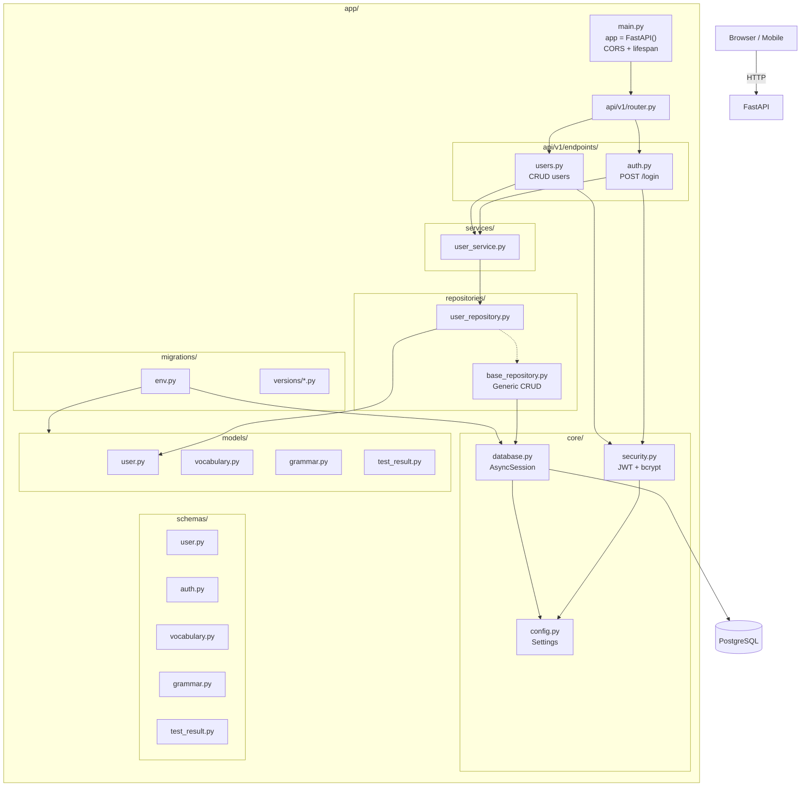
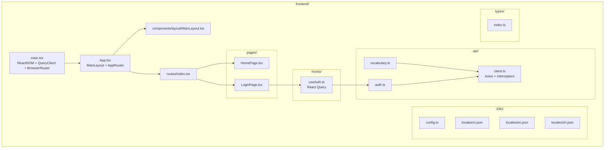
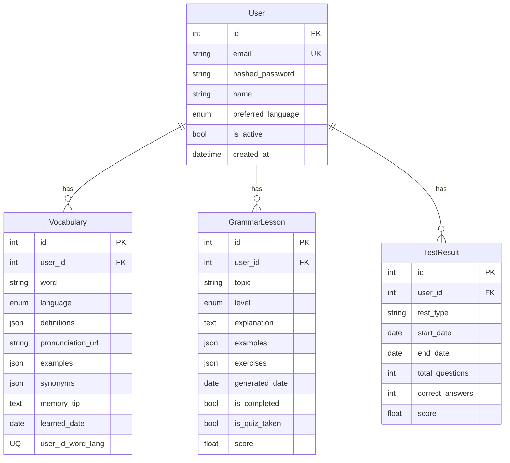
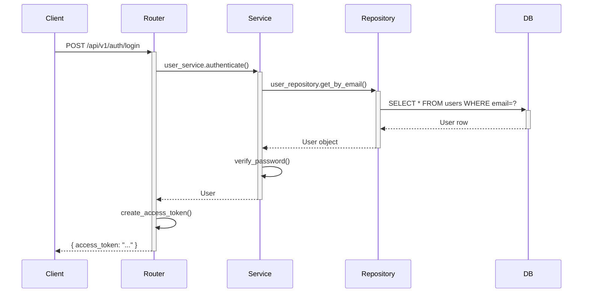

# VisionNest — Kiến trúc dự án

> File này được cập nhật mỗi khi có thay đổi cấu trúc project.

---

## 1. Tổng quan

```
VisionNest/
├── app/               # Backend (FastAPI + PostgreSQL)
├── frontend/          # Frontend (React + TypeScript + Tailwind)
├── tests/             # Backend tests
├── PROJECT.md         # Tổng quan dự án
├── ARCHITECTURE.md    # (file này) Sơ đồ kiến trúc
└── README.md
```

---

## 2. Backend Flow



---

## 3. Frontend Flow



---

## 4. Database Schema



---

## 5. Kiến trúc Backend (Clean 3-layer)

```
HTTP Request
    → Router (endpoints/)       — Xác thực, validate, routing
        → Service (services/)   — Business logic, orchestration
            → Repository (repositories/) — CRUD, DB queries
                → Model (models/) — SQLAlchemy ORM mapping
```

- **Router** không chứa logic — chỉ gọi Service, trả response
- **Service** chứa business logic — không biết DB
- **Repository** chỉ thao tác DB — không biết logic

---

## 6. Luồng request ví dụ



---

> ⚠️ **Ghi chú**: Khi thêm/sửa/xóa models, endpoints, services, hoặc cấu trúc thư mục, hãy cập nhật file `ARCHITECTURE.md` này tương ứng.
