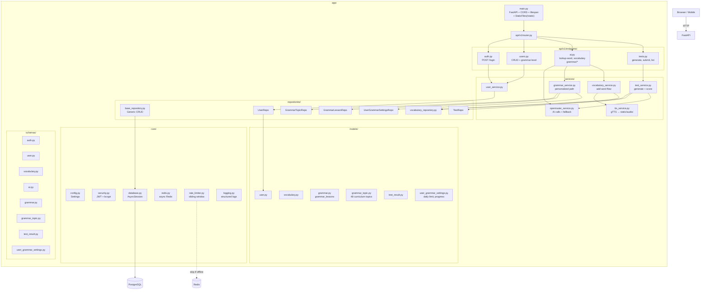

# VisionNest — Kiến trúc dự án

> File này được cập nhật mỗi khi có thay đổi cấu trúc project.

---

## 1. Tổng quan

```
VisionNest/
├── app/                  # Backend (FastAPI + PostgreSQL)
│   ├── api/
│   │   ├── v1/
│   │   │   ├── endpoints/  # auth.py, users.py, ai.py, tests.py
│   │   │   └── router.py
│   │   └── dependencies.py # HTTPBearer auth
│   ├── core/             # config, security, database, redis, rate_limiter, logging
│   ├── models/           # user, vocabulary, grammar, grammar_topic, test_result, user_grammar_settings
│   ├── schemas/          # Pydantic validation
│   ├── services/         # user_service, openrouter_service, grammar_service, vocabulary_service, tts_service, test_service
│   ├── repositories/     # base_repository + specialized repos
│   └── migrations/       # Alembic
├── frontend/             # React + TypeScript + Tailwind
├── data/                 # grammar_curriculum.yaml (48 topics)
├── scripts/              # seed_grammar.py
├── static/audio/         # TTS mp3 files (auto-mounted)
├── tests/                # 47 tests
├── API_REFERENCE.md      # Full JSON schemas for FE
└── docker-compose.yml    # PostgreSQL + Redis
```

---

## 2. Backend Flow


```mermaid
graph TB
    Client["Browser / Mobile"] -->|HTTP| FastAPI

    subgraph Backend["app/"]
        Main["main.py<br/>FastAPI + CORS + lifespan<br/>+ StaticFiles(/static)"]
        Router["api/v1/router.py"]

        subgraph Endpoints["api/v1/endpoints/"]
            AuthEP["auth.py<br/>POST /login"]
            UsersEP["users.py<br/>CRUD + grammar-level"]
            AIEP["ai.py<br/>lookup-word, vocabulary<br/>grammar/*"]
            TestsEP["tests.py<br/>generate, submit, list"]
        end

        subgraph Core["core/"]
            Config["config.py<br/>Settings"]
            Security["security.py<br/>JWT + bcrypt"]
            DB["database.py<br/>AsyncSession"]
            Redis["redis.py<br/>async Redis"]
            RateLimit["rate_limiter.py<br/>sliding window"]
            Logging["logging.py<br/>structured logs"]
        end

        subgraph Services["services/"]
            UserSvc["user_service.py"]
            OpenRouterSvc["openrouter_service.py<br/>AI calls + fallback"]
            GrammarSvc["grammar_service.py<br/>personalized path"]
            VocabSvc["vocabulary_service.py<br/>add word flow"]
            TtsSvc["tts_service.py<br/>gTTS → static/audio/"]
            TestSvc["test_service.py<br/>generate + score"]
        end

        subgraph Repos["repositories/"]
            BaseRepo["base_repository.py<br/>Generic CRUD"]
            UserRepo
            VocabRepo["vocabulary_repository.py"]
            GrammarTopicRepo
            GrammarLessonRepo
            TestRepo
            UserGrammarSettingsRepo
        end

        subgraph Models["models/"]
            UserModel["user.py"]
            VocabModel["vocabulary.py"]
            GrammarModel["grammar.py<br/>grammar_lessons"]
            GrammarTopicModel["grammar_topic.py<br/>48 curriculum topics"]
            TestModel["test_result.py"]
            UserGrammarSettingsModel["user_grammar_settings.py<br/>daily limit, progress"]
        end

        subgraph Schemas["schemas/"]
            AuthSchema["auth.py"]
            UserSchema["user.py"]
            VocabSchema["vocabulary.py"]
            AISchema["ai.py"]
            GrammarSchema["grammar.py"]
            GrammarTopicSchema["grammar_topic.py"]
            TestSchema["test_result.py"]
            UserGrammarSettingsSchema["user_grammar_settings.py"]
        end
    end

    PostgreSQL[("PostgreSQL")]
    RedisCache[("Redis")]

    Main --> Router
    Router --> AuthEP & UsersEP & AIEP & TestsEP
    AuthEP --> UserSvc --> UserRepo --> UserModel
    UsersEP --> UserSvc
    AIEP --> OpenRouterSvc & GrammarSvc & VocabSvc
    VocabSvc --> TtsSvc
    VocabSvc --> VocabRepo
    GrammarSvc --> GrammarTopicRepo & GrammarLessonRepo & UserGrammarSettingsRepo
    TestsEP --> TestSvc --> TestRepo
    TestSvc --> VocabRepo
    TestSvc --> OpenRouterSvc
    RateLimit -.->|skip if offline| RedisCache
    BaseRepo --> DB --> PostgreSQL
```

---

## 3. Database Schema

```mermaid
erDiagram
    User ||--o{ Vocabulary : has
    User ||--o{ GrammarLesson : has
    User ||--o{ TestResult : has
    User ||--o{ UserGrammarSettings : has
    GrammarTopic ||--o{ GrammarLesson : references

    User {
        int id PK
        string email UK
        string hashed_password
        string name
        enum preferred_language
        string role
        string grammar_level
        bool is_active
        datetime created_at
    }

    Vocabulary {
        int id PK
        int user_id FK
        string word
        enum language
        json definitions
        string pronunciation_url
        json examples
        json synonyms
        text memory_tip
        date learned_date
        UQ user_id_word_lang
    }

    GrammarTopic {
        int id PK
        int order_num
        string topic
        string level
        string category
        text description
        bool is_active
    }

    GrammarLesson {
        int id PK
        int user_id FK
        int topic_id FK "nullable"
        string topic
        string level
        text explanation
        json examples
        json exercises
        date generated_date
        bool is_completed
        bool is_reviewed
        bool is_quiz_taken
        float score
    }

    UserGrammarSettings {
        int id PK
        int user_id FK UK
        string start_level
        int current_order
        int daily_limit
        date last_study_date
        int lessons_today
        datetime updated_at
    }

    TestResult {
        int id PK
        int user_id FK
        string test_type
        date start_date
        date end_date
        json questions
        json answers "nullable; null = chưa nộp"
        int total_questions
        int correct_answers
        float score "nullable; null = chưa nộp"
    }
```

---

## 4. Kiến trúc Backend (3-layer)

```
HTTP Request
    → Router (endpoints/)       — Xác thực, validate, routing
        → Service (services/)   — Business logic, orchestration
            → Repository (repositories/) — CRUD, DB queries
                → Model (models/) — SQLAlchemy ORM
```

- **Router** không chứa logic — chỉ gọi Service, trả response
- **Service** chứa business logic — orchestrates AI calls, TTS, DB operations
- **Repository** chỉ thao tác DB — không biết logic

---

## 5. Key Data Flows

### Grammar Learning Path
```
User sets level (A1/A2/B1/B2)
  → GrammarService.set_grammar_level()
    → creates UserGrammarSettings (start_level, current_order)
    → maps: A1→order1, A2→order13, B1→order25, B2→order37

GET /grammar/today
  → GrammarService.get_today_plan()
    → finds unreviewed completed lessons (priority)
    → finds next uncompleted topic within daily limit

POST /grammar/generate { topic_id }
  → OpenRouterService.generate_grammar(topic, level)
  → saves GrammarLesson → returns explanation + examples + exercises
```

### Add Word Flow
```
POST /ai/lookup-word { word, language }
  → check duplicate → 409 if exists
  → OpenRouterService.lookup_word(word, language)
    → definitions, examples, synonyms, memory_tip
  → TTSService.generate(word, language)
    → /static/audio/{uuid}.mp3 (pronunciation_url)
  → saves Vocabulary → returns DTO
```

### Test Engine
```
POST /tests/generate { start_date, end_date }
  → get vocabulary in date range (min 5)
  → OpenRouterService.generate_test()
    → 15 questions (5 multiple_choice + 5 fill_in_blank + 5 listening)
  → saves TestResult (answers=null) → returns questions without answers

POST /tests/{id}/submit { answers }
  → compare answers → calculate score
  → updates TestResult → returns detailed results
```

---

## 6. Services Overview

| Service | File | Responsibilities |
|---------|------|------------------|
| UserService | `user_service.py` | Create, authenticate, update users |
| OpenRouterService | `openrouter_service.py` | AI calls with fallback + retry |
| GrammarService | `grammar_service.py` | Personalized learning path orchestration |
| VocabularyService | `vocabulary_service.py` | Add-word flow (check → AI → TTS → DB) |
| TTSService | `tts_service.py` | gTTS wrapper → save to static/audio/ |
| TestService | `test_service.py` | Generate test + submit + score |

---

> ⚠️ Khi thêm/sửa/xóa models, endpoints, services, hãy cập nhật file này tương ứng.
